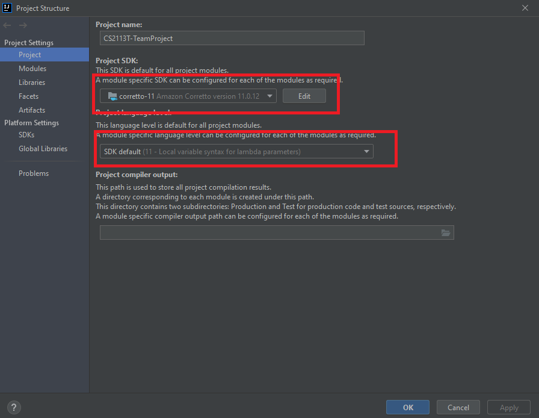
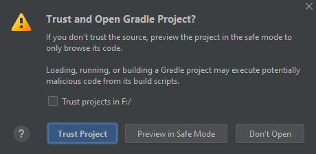
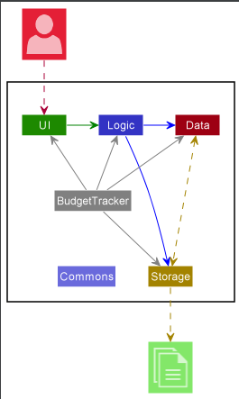
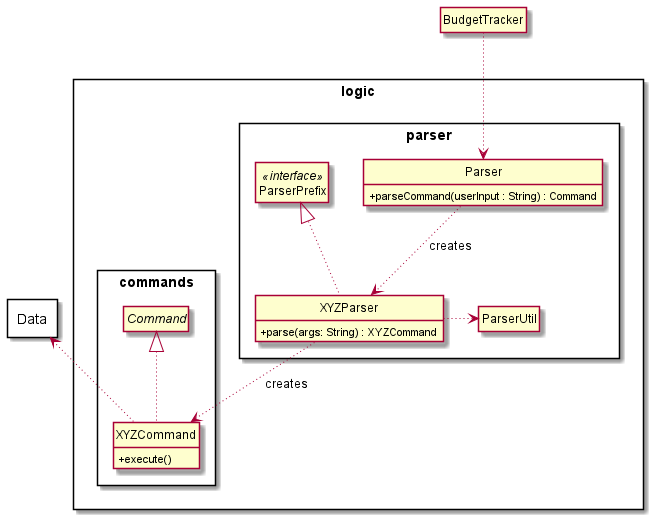
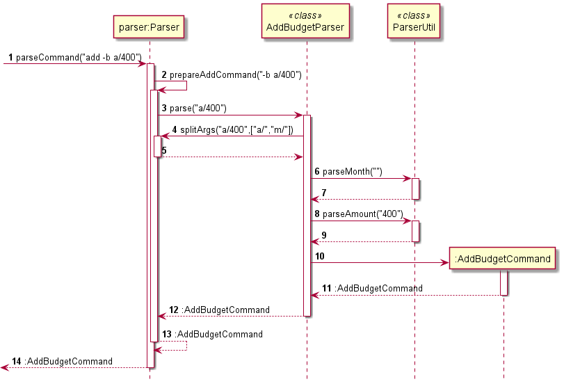
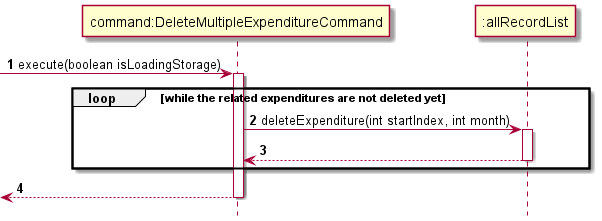
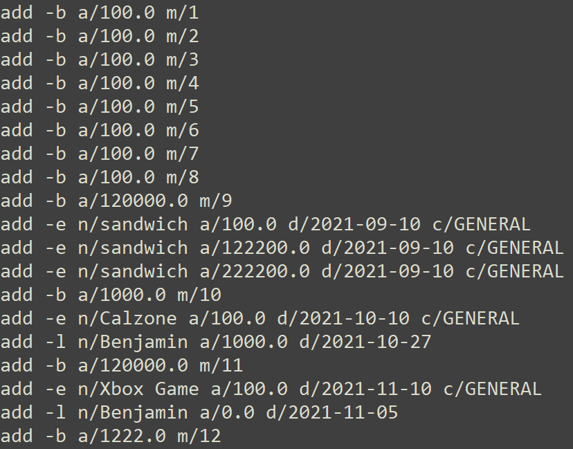

# Developer Guide

## Table of Content
* [Acknowledgements](#acknowledgements)
* [Getting started](#getting-started)
* [Design](#design)
  * [Architecture](#architecture)
  * [UI Component](#ui-component)
* [Implementation](#implementation)
  * [Delete - Basic Command Logic](#delete---basic-command-logic)
* [Product scope](#product-scope)
  * [Target user profile](#Target-user-profile)
  * [Value proposition](#value-proposition)
* [User Stories](#user-stories)
* [Non-Functional Requirements](#non-functional-requirements)
* [Glossary](#glossory)
* [Instructions for manual testing](#Instructions-for-manual-testing)

## <a id="acknowledgements"></a> Acknowledgements
* Inspiration for User Guide and Developer Guide: AddressBook (Level 3)
  * https://se-education.org/addressbook-level3/UserGuide.html
  * https://se-education.org/addressbook-level3/DeveloperGuide.html
* The ParserUtil class under our logic component was inspired from AddressBook (Level 3)'s [ParserUtil class](https://github.com/se-edu/addressbook-level3/blob/ba53b8cea3aa025d17094dbd6c541b046a5f5d7a/src/main/java/seedu/address/logic/parser/ParserUtil.java). We followed the same naming style but use our own unique methods.
  
{list here sources of all reused/adapted ideas, code, documentation, and third-party libraries -- include links to the
  original source as well}

## <a id="getting-started"></a> Getting started

### Setting up IDE and Repository

1) Forking and cloning
Fork our repository from this [link](https://github.com/AY2122S1-CS2113T-F11-2/tp).
Then, clone your fork into your local computer. 

2) Editor
[Intellij](https://www.jetbrains.com/idea/download/download-thanks.html?platform=windows&code=IIC) 
is the recommended IDE to view and edit our source code. 

3) Configure JDK
Ensure that the correct version of JDK is downloaded and installed as our app is only tested on Java 11.
You may run the following command: `java -version` to check for the current Java version which your computer is running.
If you are using Intellij, please check that your project structure's project SDK is set to Java 11 and Project Language Level is set
to default SDK.



4) Importing project
Right click on the Repository folder that you have clone into your machine and select "Open Folder as Intellij IDEA Community Edition Project".
When you are asked whether to trust and open gradle project, click trust. 



5) Verifying BudgetTracker Runs
Right click on BudgetTracker then click on run to test our our BudgetTracker App. 


### Additional Consideration

## <a id="design"></a> Design 

### Architecture


The ***Architecture Diagram*** given above explains the high-level design of the App.

Given below is a quick overview of main components and how they interact with each other.

**Main components of the architecture**

At app launch, **`BudgetTracker`** is in charge of initializing the components and linking them by passing some 
initialized components into others as parameters. 

For example, an initialized variable of `Data` is passed into an initialized variable of `Storage` for
the `Storage` component to load hard disk information into the memory.

[**`Commons`**](#common-classes) consists of the exception classes for exception handling and messages used by other classes.

The rest of the App consists of four components.

* [**`UI`**](#ui-component): The User Interface of the App -- Reads User Input and displays queried data.
* [**`Logic`**](#logic-component): Parses User Input and executes the corresponding command.
* [**`Data`**](#data-component): Holds the data of the App in memory.
* [**`Storage`**](#storage-component): Reads data from, and writes data to, the hard disk.


**How the architecture components interact with each other**

The *Sequence Diagram* below shows how the components interact with each other for the scenario where the user issues the command `add -e m/1 a/500`.


### <a id="ui-component"></a> UI Component
**API**: [`ui.java`](https://github.com/AY2122S1-CS2113T-F11-2/tp/tree/master/src/main/java/seedu/budgettracker/ui)


The `Ui` component:
- Reads in user input from the Command Line Interface (CLI).
- Prints welcome screen, database information and messages prompting the user for input.
- Other components call methods in Ui class to print corresponding output on the terminal.

### <a id=""></a> Data Component
Below is a partial class diagram that shows an overview of the `Data` component.


The `Data` component:


### <a id=""></a> Logic Component (Parser and Commands)

Figure 3. Structure of the program's logic

1. `BudgetTracker` uses `Parser` to parse user input into a `Command`.
2. This results in the creation of an `XYZParser` (where 'XYZ' represents 'AddBudget', 'EditLoan', etc.) which in turn creates a `XYZCommand`.
3. The `XYZCommand` being executed affects the `Data` component.
4. Additionally, during execution of `XYZCommand`, `Ui` (not shown) will display helpful messages to the user.

Given below is the Sequence Diagram for interactions with the Parser and Command components for the `parseCommand("add -b a/400")` call.

Figure 4. Sequence Diagram of program's logic with a `add -b a/400` call.

### <a id=""></a> Storage Component (Loading and Storing Data)

The Storage component consists of:

The `Storage` component:

1) What it does?
- During the first launch of the app, it creates a new current year database text file if there isn't any. 
it will then load the data from the database text file into the app. 
- Allows user to change the data base to the year he wants. 
- It also allows the conversion of a database into CSV format so that the user can perform more sophisticated statistical analysis.
- Upon performing any commands that will perform changes to the database such as `add`, `edit`, `delete`
Storage will reload the data in the app into the database text file. 

2) Architecture of the Storage component


- Initially, when BudgetTracker App is started, it will create new Parser and Storage object. Storage's 
makeStorageTextFile() method will be called to either create a new database text file of the current year
for example "2021.txt" if it does not exist or it will load the existing "2021.txt" into the App by calling 
loadStorage() method of the Storage Class.
- Then a while loop will be initialized to check for User Input in the command line to check for user's 
command. Whenever any command that changes the data in the App is called such as `add`, `edit` and `delete` 
is called, reloadArrayToStorage() method of the WriteToTextFile class must be called to refresh the data text
file to the new state of the data in the App. 
- Then the loop will continue. For commands that will not change the data in the app such as `list`, `find`...
The reloadArrayToStorage() method will not be called. 

## <a id="implementation"></a> Implementation

### <a id=""></a> Delete - Basic Command Logic

The delete feature collaborates with other classes like Parser, RecordList, etc. Basically it contains three usages which are deletion of Budget, Expenditure(s), and Loan(s).

For example, when user keys ```delete -b m/MONTH```, The Parser class will analyse the whole command, and extract “b/” and “MONTH”. Then the class DeleteBudgetCommand will execute the deletion by using recordList.deleteBudget(MONTH).

A more specific example with sequence diagram will be given at the end of this section.

Similarly, we have our Parser to parse the commands for deletion of expenditures and loans:
* ```delete -e m/MONTH``` — If there's no index value specified in the input, we use for loop to delete all expenditures within a month.
* ```delete -e m/MONTH i/INDEX``` — If the value at the position after ‘i/’ is an integer, we use DeleteSingleExpenditureCommand to delete this specific expenditure in this specific month.
* ```delete -e m/MONTH i/INDEX-INDEX``` — If the value at the position after ‘i/’ is a range of integers, we firstly use split[] to extract the starting and ending integers, and then we use DeleteMultipleExpenditureCommand to delete the expenditures in this range in this specific month. (also by using for loop)

<br/>

All the delete command classes (DeleteAllExpenditureCommand, DeleteSingleExpenditureCommand, DeleteMultipleExpenditureCommand, and DeleteBudgetCommand) extend from DeleteCommand class, and DeleteCommand class extends from Command class. Inside each command class, we have a constructor and an override function called execute to execute the specific deletion task assigned to them.

<br/>

Given below is an example usage scenario and how the delete feature behaves at each step.

<br/>

**Step 1**. The user launches the application for the first time.
<br/> **Step 2**. The user adds a budget and some expenditures to the current month.
<br/> **Step 3**. The user finds that the budget is a bit insufficient, thus the user wants to delete some expenditures.
<br/> **Step 4**. After consideration, the user decides to delete expenditure 3-5, so he keys ```delete -e m/10 i/3-5``` for Parser class to parse:
* ```parseCommand(String userInput)``` specifies the user input as a delete command, then calls the method ```prepareDeleteCommand(String commandParams)``` inside the class.
* By using substring method, description, indexes, and month of the expenditures are extracted in ```deleteParams```, ```prepareDeleteCommand(commandParams)``` calls ```DeleteExpenditureParser.parse(deleteParams)``` to parse the params more specifically.
* Method ```parse(String args)``` in class ```DeleteExpenditureParser``` returns newly created object ```DeleteMultipleExpenditureCommand(startIndex, endIndex, month)```.
<br/>
  

**Step 5**. The newly created object ```DeleteExpenditureCommand``` will execute the deletion:
* ```execute(boolean isLoadinStorage)``` runs a for loop to delete the related expenditures in the expenditure ArrayList.
* ```for(int i = startIndex; i <= endIndex; i++)``` iterates the 3 expenditures, everytime it just calls ```allRecordList.deleteExpenditure(startIndex, month)``` to delete each expenditure.
<br/>
  


### <a id=""></a> Edit feature

The edit mechanism is facilitated by AllRecordList which extends from RecordList. It implements the following operations:
* ```AllRecordList#editBudget()``` — Edits a budget to the record list.
* ```AllRecordList#editExpenditure()``` — Edits an expenditure to the record list.
* ```AllRecordList#editLoan()``` —Edits a loan record to the record list.

<br/>

These operations are exposed in the ```EditBudgetCommand```, ```EditExpenditureCommand``` and ```EditLoanCommand``` classes, which extend from the ```Command``` subclass as ```EditBudget#execute()```, ```EditExpenditure#execute()``` and ```EditLoan#execute()``` respectively.

<br/>

Given below is an example usage scenario and how the ```edit``` mechanism behaves at each step.

<br/>

**Step 1**. The user launches the application for the first time. The ```AllRecordList``` will be initialized with the initial record list state.
<br/> **Step 2**. The user executes add …  to ```add``` a new record into the record list. The add command also calls Storage#saveToStorage(), causing a modified record list state to be saved into the storage file.
<br/> **Step 3**. The user now realises that there was a mistake in the record added, and decides to edit the record by executing the ```edit``` command. The edit command will call ```AllRecordList#edit…``` based on the record type.


### <a id=""></a> Listing

The list feature works with Parser, Recordlist and TextUi, and allows users to see the listing of the budget and expenditures in either a specific month or every month.

When user keys ```list m/Month [c/CATEGORY]```, The Parser class will analyse the whole command, extract "m/", "MONTH", "c/" and "CATEGORY", analyse whether MONTH is an integer or “all”, and check whether CATEGORY has been assigned. The boolean isListAll will be assigned as true if the value after “m/” is “all”. Then the class ListRecordsCommand will execute the listing by using TextUi.showRecordsListView(recordList, MONTH, isListAll)).

Similarly, we have our Parser to parse the commands for listing of expenditures
* ```list m/Month [c/CATEGORY]``` — If the value at the position after ‘m/’ is an integer, we use hashtable to list the budget and all expenditures of a  specific month.
* ```list m/all [[c/CATEGORY]``` — If the value at the position after ‘m/’ is “all”, we use for loop to list all the budget and expenditures of every month.

Given below is an example usage scenario and how the list feature behaves at each step.

**Step 1**. The user launches the application for the first time.
<br/> **Step 2**. The user adds a budget and some expenditures to the current month.
<br/> **Step 3**. The user forgets what the budget and expenditures added, thus the user wants to see the budget and the list of the expenditures.
<br/> **Step 4**. After consideration, the user decides to see the budget and list of May, so he keys ```list m/5```
<br/> **Step 5**. The Parser starts to parse the command, it extracts month 5. As this is a specific month to be listed, the Parser class calls ListRecordsCommand to work. By finding May, the expenditures list and budget of May are successfully found and prints out a showRecordsListView from TextUi class.


### <a id=""></a> Storage 

1) How are the data stored?

The storage stores the exact `add` command of budget, expenditures and loan into the text file containing 
in the current AllRecordList. Everytime a deleted, edit or add command is called, the txt file is automatically 
wiped and re-written from the ArrayList to ensure that data is saved at every step. 



2) Why are the data stored in such a manner?

The reason it is implemented in this manner is so that we could reuse
code that have been written for adding of budget and expenditures directly when loading from storage.

This implementation makes Storage very versitile even when there are substantiate changes in the architecture 
of our app. Some examples are the changes to Parser, Logic and Commands. Even with these stated changes, 
the Storage needs very little tweaks to the Storage for it to work with the new implementation. The reason
is that Storage uses the code used in Parser to load the data into the app. For the saving of data, only the 
reloading method needs to be editted to adhere to the new changes such that the adding command stored is of
the correct format.

The way the database is organized is that each yearly Records is stored in the form of <year>.txt. Each year 
contains all the monthly budget as well as all the expenditure and loan tied to that month. 

3) How does some of the key method work?


4) How switching database work?

When the `year <SELECTED DATABASE YEAR>` command is called eg. `year 2020`, the Parser will call the YearCommand
and it will run the method "execute()". "execute()" first clears the allRecordList by calling clearAll() from 
the AllRecordList class. And setYear(2020) method is called from AllRecordList Class to set the year to 2020. 
Then the loadStorage method of Storage Class will be called to load the datafile "2020.txt" into the app.  

## <a id=""></a> List of Commands


## <a id=""></a> Appendix A: Product scope

### <a id=""></a> Target user profile

- has a need to manage a significant number of expenditures
- prefer desktop apps over other types
- can type fast
- prefers typing to mouse interactions
- is reasonably comfortable using CLI apps

### <a id=""></a> Value proposition

This application allows users to record and track expenses more conveniently,
and thereby encourages them to have greater control over their finances.

## <a id=""></a> Appendix B: User Stories

|Version| As a ... | I want to ... | So that I can ...|
|--------|----------|---------------|------------------|
|v1.0|student|record/add my outgoing and incoming expenses|track my expenses, see how I spent my money and I can also learn how to plan and manage my money wisely.|
|v1.0|financially handicapped|see my spendings over a period of time|won’t overspend.|
|v1.0|user|delete my spending records|remove unwanted or incorrect records.|
|v1.0|user|set a budget target|see whether my spendings exceeds my budget.|
|v1.0|financially strained student|view my budget target|know the limit to not overspend.|
|v1.0|user|delete my budget target|discard incorrect budget entries.|
|v1.2|new user|see a list of available commands so that I know how to use the APP|like a help list similar to cmd’s “help” command|
|v1.2|user|record down the money I have lent out to the correspondents|take note of who to collect money from.|
|v1.2|user|see the amount of money I have loaned out and to whom I have loaned it to |track who owe me money.|
|v2.0|analytical person|see the specifics on the statistics of when I spent too much on what exactly|make an amendment to my habits. / As a user trying to cut down on my expenses, I want to see the category(s) which I have spent the most money on in the past 3/6months so that I can cut down on those expenses.|
|v2.0|budget minded person|see the stats (mean, sd, median… of my yearly expenditure) of my overall expenditure and overall net income|know when to cut down on expenses|
|v2.0|person who always overspends|a warning on overspending|be more mindful and be reminded not to overspent my money.|
|v2.0|user|categorize my spendings|see what I spend most money on|
|v2.0|user|analyze my spendings with a chart|get my spendings components in a more direct and easier way|

## <a id=""></a> Appendix C: Non-Functional Requirements

**1**. Should work on any mainstream OS as long as it has Java 11 or above installed.
<br/> **2**. 
{Give non-functional requirements}

## <a id=""></a> Appendix D: Glossary

* *Mainstream OS*: Windows, Linux, Unix, OS-X

## <a id=""></a> Appendix E: Instructions for manual testing

{Give instructions on how to do a manual product testing e.g., how to load sample data to be used for testing}
